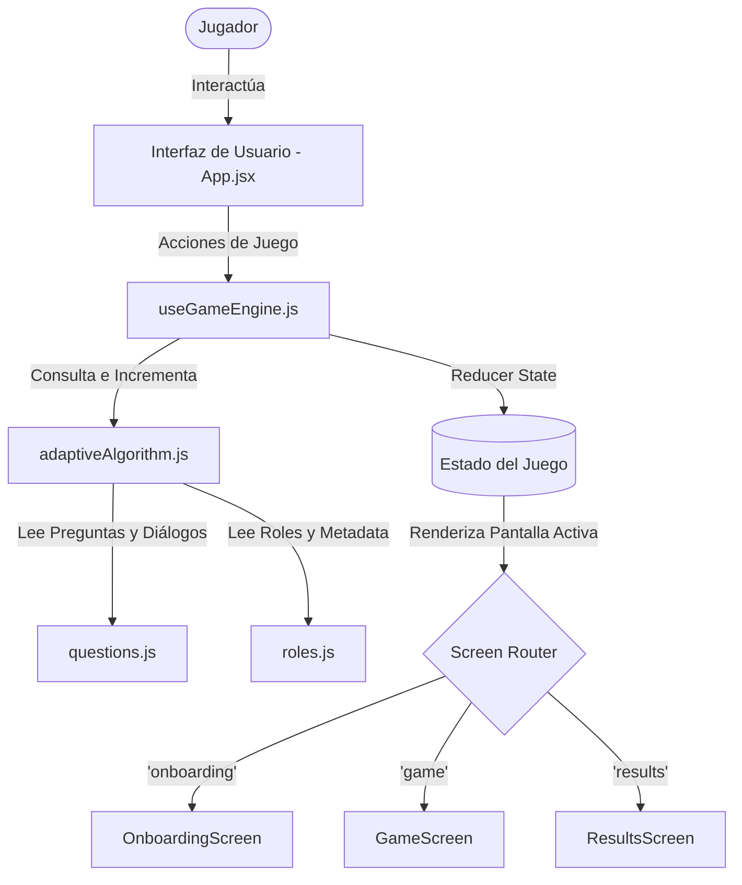
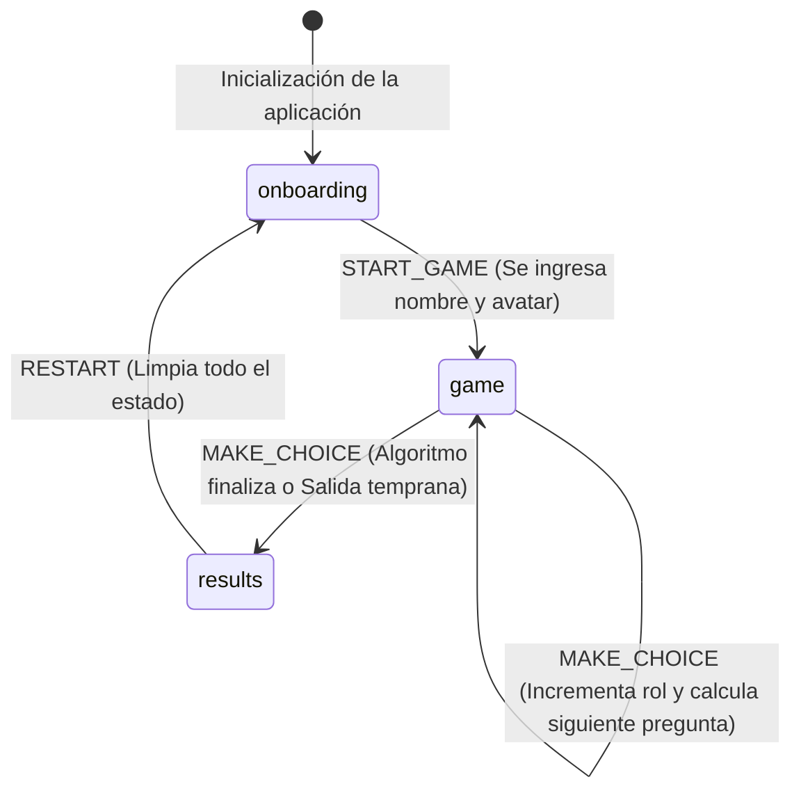
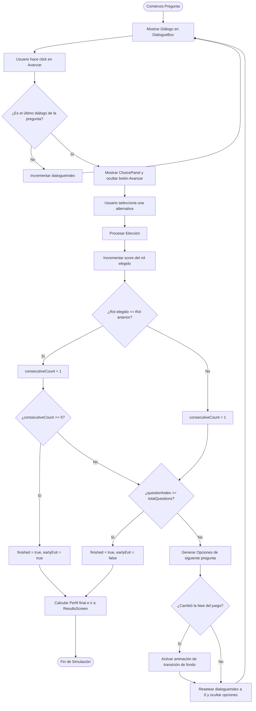
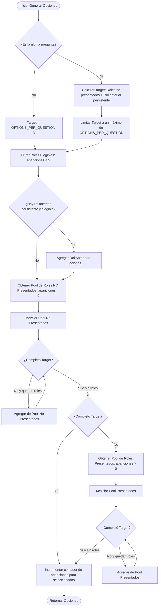

# Documento de Arquitectura de Software - SysCoffee ☕

Este documento describe la arquitectura, diseño de componentes, estado global, algoritmo adaptativo y pipeline de despliegue de **SysCoffee**, una novela visual interactiva y juego de rol (RPG) adaptativo diseñado para diagnosticar perfiles profesionales de TI.

---

## 1. Resumen del sistema

SysCoffee es una aplicación frontend de página única (**SPA - Single Page Application**) autocontenida, construida con tecnologías modernas y optimizada para ejecutarse enteramente del lado del cliente.

### Tecnologías Core
*   **Biblioteca Principal:** utilizando componentes funcionales, hooks personalizados y gestión de estado reactiva.
*   **Empaquetador y Servidor de Desarrollo:** carga de módulos ultra rápida basada en ES Modules nativos.
*   **Sistema de Estilos:** diseño adaptativo con la nueva integración nativa mediante `@tailwindcss/vite`.
*   **Linter:** análisis estático de código de alto rendimiento en Rust.

---

## 2. Diagrama de arquitectura general

El flujo de información y control del juego se organiza en un flujo descendente donde la UI reacciona a los cambios en el motor de juego:



---

## 3. Gestión de estado global y flujo de pantallas

El control de la aplicación se centraliza a través de una máquina de estados implementada en el hook personalizado `useGameEngine.js` mediante el hook de React `useReducer`.

### Ciclo de vida del estado (`gameReducer`)
La aplicación transiciona entre tres pantallas principales:



1.  **`onboarding`:** Pantalla inicial para capturar el nombre del jugador y selección de avatar.
2.  **`game`:** Pantalla interactiva que coordina los paneles de fondo, el sprite del personaje activo, la caja de diálogos secuenciales y el panel de alternativas de rol.
3.  **`results`:** Pantalla de diagnóstico final que expone el perfil primario, perfiles secundarios sugeridos, y un formulario de retroalimentación.

### Flujo de juego
El siguiente diagrama detalla cómo avanza el juego paso a paso para el usuario en cada pregunta:



---

## 4. Algoritmo vocacional adaptativo

La lógica central del juego reside en `adaptiveAlgorithm.js`. Evalúa al usuario entre **11 roles TI** mediante una serie de preguntas dinámicas.

### Reglas y mecánicas del algoritmo

*   **Población de Opciones Dinámica:** Para cada una de las 5 preguntas del juego, el algoritmo presenta exactamente `OPTIONS_PER_QUESTION = 3` alternativas.
*   **Persistencia de Elección:** Si un usuario elige una alternativa de cierto rol (ej: Frontend), esa misma opción persistirá como una alternativa en la siguiente pregunta para verificar su consistencia.
*   **Priorización de Roles No Presentados:** El algoritmo prioriza la aparición de roles con `appearances === 0` para garantizar que todos los 11 roles tengan la oportunidad de ser evaluados de manera uniforme.
*   **Salida Temprana (Early Exit):** Si el jugador elige el **mismo rol de manera consecutiva 5 veces** (`EARLY_EXIT_THRESHOLD`), el algoritmo finaliza la simulación inmediatamente al haber detectado un perfil con alta certeza, omitiendo las preguntas restantes.
*   **Cálculo de Perfil:**
    *   **Primario:** El rol que acumula el puntaje máximo.
    *   **Secundario:** Los dos roles siguientes con puntuaciones mayores a 0, ordenados de forma descendente.

### Generación dinámica de opciones
El siguiente flujo detalla el comportamiento del método `generateOptions` al armar el panel de alternativas para cada pregunta:



---

## 5. Arquitectura de archivos y componentes

El proyecto se estructura con una organización modular por responsabilidades:

```bash
src/
├── components/           # Componentes visuales organizados por pantalla
│   ├── Game/             # Componentes de la escena de juego interactivo
│   │   ├── Background.jsx      # Controla transiciones y fondos según la fase
│   │   ├── CharacterSprite.jsx # Renderiza los avatares y personajes con micro-animaciones
│   │   ├── ChoicePanel.jsx     # Renderiza las opciones A, B y C de forma neutral
│   │   ├── DialogueBox.jsx     # Administra el texto y el avance del diálogo
│   │   ├── GameScreen.jsx      # Orquesta la pantalla del juego
│   │   └── ProgressBar.jsx     # Barra de progreso lineal superior
│   ├── Onboarding/       # Componentes del registro inicial
│   └── Results/          # Pantallas de cierre y feedback
├── data/                 # Archivos estáticos de datos narrativos y configuración
│   ├── questions.js      # Escenarios de crisis técnica y alternativas por rol
│   └── roles.js          # Metadatos del perfil (iconos, colores, descripción)
├── engine/               # Núcleo algorítmico e independiente de React
│   └── adaptiveAlgorithm.js
├── hooks/                # Estado del juego expuesto a los componentes
│   └── useGameEngine.js
├── App.jsx               # Enrutador principal de vistas
├── config.js             # Configuración del entorno (ej: Formspree, depuración)
├── index.css             # Estilos globales y variables de Tailwind v4
└── main.jsx              # Punto de anclaje de React en el DOM
```

---

## 6. Sistema de diseño

SysCoffee implementa un estilo visual de **Web Comic** con un ambiente "cozy" y premium basado en café, definido en `index.css`:

*   **Paleta Cafetera:** Fondos oscuros profundos (`#1a0e05` a `#2d1a0a`), paneles de vidrio con desenfoque (`backdrop-filter: blur`) y acentos de color ámbar y dorado (`#d4943f`).
*   **Tipografía Híbrida:**
    *   `Cinzel` para logotipos y encabezados de impacto.
    *   `Lora` para los textos y diálogos de los personajes, simulando una novela gráfica.
    *   `Inter` para legibilidad técnica en botones, barras de progreso y formularios.
*   **Estilo Comic Panel:** Los contenedores principales usan bordes de `4px` sólidos, sombras pronunciadas y esquinas redondeadas acentuadas para dar el aspecto de viñetas de historieta física.

---

## 7. Infraestructura de CI/CD

El proyecto cuenta con una infraestructura de automatización de despliegue robusta en GitHub Actions distribuida en dos flujos de trabajo independientes por seguridad y eficiencia.

*   **Integración Continua (`ci.yml`):** Valida la calidad de cada cambio de código en ramas de desarrollo o Pull Requests mediante la ejecución automática de oxlint y una compilación de prueba en Node.js 20.
*   **Despliegue Continuo (`deploy.yml`):** Compila la aplicación con las variables de producción y utiliza la API moderna de artefactos de GitHub para actualizar de manera transparente e instantánea el sitio en producción.
